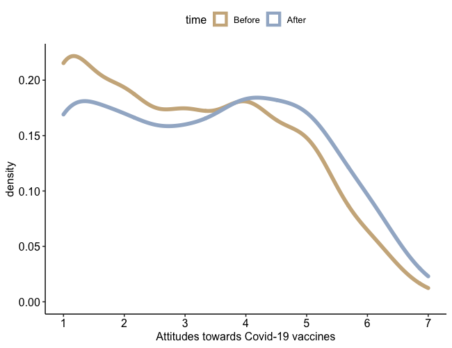
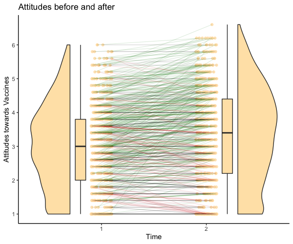

```{r setup,}
library(knitr)
knitr::opts_chunk$set(echo = FALSE, message=FALSE, warning=FALSE, fig.height=2, fig.width=4)
library(rethinking)
#library(here)
```

`r figsize<-'100%'`

# Introduction


Communicating the effectiveness, safety and necessity of vaccination to the general public is arguably one of science communication’s most important and emblematic challenges. Appropriately, huge amounts of attention and research effort has been directed towards how to increase Covid-19 vaccination uptake. Due to the urgency and impact of the problem, a multi-pronged attack is warranted, and thus research rightly spans many different strategies, from pre-empting misinformation on social media [@vraga_addressing_2021], presenting information on the comparison of Covid-19 symptoms to vaccination side-effects [@thorpe_communicating_2021], presenting information on the timeline of vaccine development [@thorpe_communicating_2021], different styles of myth-busting [@challenger_covid-19_2021], the use of social norms [@moehring_surfacing_2021], framing messaging in terms of individual risk preferences [@trueblood_role_2020] and even chatbots [@altay2021information], all with varying levels of success.  

Although chatbots are usually used for aiding the completion of tasks, for example navigating website FAQs or purchasing personalised items (train tickets, flights),  interest is growing in their ability to create engaging, human-like dialogue. One way in which chatbots could be used for attitude change is their ability to deliver counter-arguments to common questions or concerns.  The use of chatbots to change attitudes has previously been explored in the context of GMO attitudes [@altay_scaling_2020]. This experiment found that the chatbot had a positive effect on GMO attitudes compared to two comparisons; 1) a short description of GMOs 2) a description of the consensus scientific view, but, it did not have a positive effect compared to a third condition: a counterargument condition. In this counterargument condition, participants were exposed to all GMO beliefs and counterarguments at once, rather than choosing which counterarguments to interact with. This suggested that providing access to counterarguments, rather than choice of information, was the driving factor behind the success of the chatbot. They found that the positive attitudes were mediated by time spent in the conditions, and that people spent on average longer in the counterargument condition. Crucially, they also found that in the chatbot condition, for three out of four arguments, the best predictor for selecting a given argument was how negative their initial view towards it was, suggesting participants did seem to select arguments based on their concerns. 

This idea that choice of information is important chimes with research into people’s apparent preference for choosing their own actions, making their own decisions, and choosing what path to take, even foregoing monetary rewards to retain agency [@bobadilla-suarez_intrinsic_2017]. Domains as diverse as animal learning and robotic control have shown the importance of intrinsic motivations for agency, curiosity and control for understanding and enabling complex behaviour [@baldassarre2014intrinsic]. It is reasonable, therefore, to assume that a chatbot experience may be engaging and by turn convincing because it supports the participant in playing an active role in the dialogue, making choices about the aspects of the topic they explore.

Trust is a crucial factor for successful public health communication [@cummings2014trust]. @eiser_trust_2009 studied public attitudes to communication about pollution and found that those who didn't trust scientific communication tended to doubt the shared values of the scientists, rather than doubt their expertise. Counterwise, high trust information from other sources, such as family and friends, was not based on a misperception of greater expertise, but on the (arguably accurate) perception that these groups had their interests at heart. Low trust in government is consistently one of the strongest predictors of vaccine hesitancy [@badman2021,@uslu2021,@kamal2021rapid,@chevallier2021covid,@roozenbeek2020susceptibility,@jennings2021lack, @maraqa2021covid, @lindholt2021public but see @larson2018measuring]. Evidently the effectiveness of interventions to increase vaccination intentions may be affected by how reasons to trust the intervention are communicated.

This paper focuses on a recent study that found that information delivered by a chatbot increased positive attitudes towards, and intentions to take, Covid-19 vaccines compared to a control condition in which participants read 90 words of standard information from a government website [@altay2021information]. The chatbot enabled participants to select frequently asked questions about Covid-19 vaccinations, and then presented participants with answers to those questions. The chatbot would then present follow-up questions and further counter-arguments. We wanted to investigate precisely what it was about the chatbot that increased vaccination attitudes, specifically whether it was the a) amount of information b) time spent with the information c) interactivity or choice of information or d) trustworthiness of the information. The `chatbot' condition manifestly allows participants greater choice, but it also exposed participants to a greater amount of information, and they tended to spend more time engaged as a consequence. The chatbot condition also included content on the trustworthiness of the information being presented. As such, it isn't clear which underlying factors drove the observed effect. 

To address our question of what precisely about the chatbot drove the increase in positive vaccination attitudes and intentions, we used the same information but created two conditions in which the only difference was the interactivity of the information, i.e. the ability to choose which information to view. The amount of information (number of words),  time spent on the information, and trustworthiness of the information was the same in both our control and our choice condition. 


# Method

## Preregistered hypotheses

Our hypotheses, predictions and analyses were preregistered before data collection at <https://osf.io/t4gav>. All of our data, code and analysis scripts are available at <https://github.com/lottybrand/clickbot_analysis>.

We hypothesised that the choice condition will show a greater effect due to the ability of participants to address the concerns most important to them. If we find a difference, this is strong evidence that one of the important aspects of chatbots in changing attitudes is that it allows the participant to choose what information is addressed, aside from the trustworthiness and amount of information. This led to the following three preregistered predictions:

1) Increase in willingness to have a vaccine is predicted by condition (those in the choice condition are more likely to show an increase in their likeliness of taking the vaccine)
2) There is an interaction between condition and time of ratings, in that vaccine attitudes will be most positive in the Choice Condition in the Post-Treatment ratings compared to the Pre-Treatment ratings. 
3) The Choice Condition will be rated as more engaging than the Control Condition

## Participants

Based on Altay et al. 2021 we recruited 716 adults participants from the UK. Using the recruitment platform Prolific, we were able to prescreen for UK based participants aged between 18 and 65 who had previously answered that they were either “Against” the Covid-19 vaccinations, or “Neutral” towards the Covid-19 vaccinations (as opposed to “For” Covid-19 vaccinations). As there were 657 participants registered to Prolific who answered “Against” at the time of recruitment, we attempted to recruit as many from this pool as possible. We only recruited participants who answered “Against” for the first seven days of data collection, as per our pre-registration. This led to 479 participants who answered “Against” in total, and a remaining 237 who answered “Neutral”. The mean age was 35 and 207 participants were male (502 female, 2 non-binary, 2 other, 3 prefer-not-to-say). 10 pilot participants were recruited on 26th April and their data used for pre-registering our analysis script. The remaining participants were recruited between 14th May and 24th May 2021.

## Materials

The baseline questionnaire was almost identical to Altay et al. except that we opted to use a 7 point Likert scale as opposed to 5 points [@liddell2018analyzing]. We asked participants to rate how strongly they agree with the following statements (from 1 = Strongly Disagree to 7= Strongly Agree): *I think Covid-19 vaccines are safe*, *I think Covid-19 vaccines are effective*, *I think we’ve had enough time to develop Covid-19 vaccines*, *I think we can trust those who produce Covid-19 vaccines*, *I think it is important to be vaccinated against Covid-19*. We also asked participants if they had yet taken a dose of any Covid-19 vaccine (Yes, No) and whether they would consider taking any future dose of an approved Covid-19 vaccine offered to them (Yes, No, Undecided). 

The information we used for our two conditions was taken from the Altay et al. study. We translated the information into English using automated translation via Google Docs, proof-read it, updated it with the most recent information at the time using official UK NHS and Government sources (e.g. regarding the Astra-Zeneca blood clot news), and had the information verified and fact-checked again by an independent epidemiologist.

To mimic the main features of their chatbot - interactive choice of questions and  appropriate follow-up answers - we grouped their vaccine information into 5 main questions: 1) Is the vaccine safe? 2) Is the vaccine effective? 3) Has the vaccine been rushed? 4) Can we trust who makes the vaccine? 5) Is the vaccine necessary? We modified each section to consist of a short dialogue of between 200-500 words largely avoiding repetition. Each dialogue included a short answer, and two or three follow-up question-answer pairs. These documents, along with a document recording the main changes made to each section compared to the Altay paper can be found here <!--TK https://drive.google.com/drive/folders/1vWti9UnpRI6T1sS7EG9HnkIzyRvVLpBh --->. Thus our participants experienced almost identical information to Altay et al, in dialogue format. As with Altay et al's study, the participant experience lacked some features of full interactive chat : in both Altay et al and our study, participants were not able to freely type but chose questions from a given selection, and replies were not individually and uniquely composed. However, Altay et al's study contained bot-like features, such as a signal that a response was being composed with a "contact is typing" style message, which was not present in our study. 

Crucially,  participants in both our conditions saw information about the trustworthiness of our information from the beginning:

| *“Why should I trust you? -   We are two independent researchers, Lotty Brand and Tom Stafford, funded by a research council, with no links to pharmaceutical companies or other competing interests. *
 
| *We are interested in learning about people's vaccine attitudes, in providing reliable information about vaccines, and learning about people's engagement with this information. *
 
| *All of the information in this study has been gathered via scientific articles and reports from the past 30 years of vaccine research, as well as the most recent studies on Covid-19. The information has been checked by experts in immunology and epidemiology as of May 12th 2021.”*

Altay et al's chatbot featured trust as one of the main question options in their chatbot condition (“why should I trust you?”), with a response similar to our wording above. If trust drives effectiveness of vaccine interventions then this could have driven the difference between their conditions, rather than the presence/absence of a chatbot per se. We therefore removed this question and answer from the dialogue options and inserted it at the beginning of both conditions, to ensure all participants would see it regardless of condition or choice of information. This ensured the communication of trustworthiness of our information was consistent across both conditions. 

Our post exposure questionnaire consisted of the same covid attitude questions as the pre-exposure questionnaire, as well as questions on how engaging the experience was and how clear the information was. We also asked how often participants discuss vaccination with those who disagree with them and how often they actively learn about vaccines (e.g. via reading articles, listening to podcasts). Participants were finally asked if they would recommend our study to a friend (if yes, they were given the option to share a link via Twitter or Facebook- and we recorded the proportion that did), whether they would take part again in a month’s time, their age, gender and education level.

We included an attention check question amongst both the pre-exposure questionnaire and our post-exposure questionnaire (“We would like to check that you are paying careful attention to the information in this study. Please respond to the following item with ‘Somewhat agree’.”). We used both of these attention check answers alongside a free-response answer to check that participants were attending to the study information, i.e. we only included those that passed both attention checks and provided coherent, relevant information in the free-response text boxes (free-response text boxes were used to collect data for a different study question).  

## Procedure

Participants were randomly assigned to either the Control or Choice Condition. Participants in both conditions provided informed consent (ethical approval provided by the University of Sheffield) before answering the pre-exposure questionnaire, interacting with the experimental material, and finally answering a post-exposure questionnaire. 

In our Control Condition, participants viewed four randomly chosen dialogues of between 200-500 words each, out of the 5 possible domains of vaccination concern (*are they safe?*, *are they effective?*, *were they rushed?*, *can we trust who makes them?*, *do I need to get one?*). 

In our Choice Condition, participants were able to choose four dialogues in total of between 200-500 words each, out of the 5 possible domains of vaccination concern, as above. Therefore the amount of information that the participants were exposed to was equivalent between the Control and the Choice condition. The information is displayed identically, in 200-500 word chunks at a time, thus the information itself should be equally engaging and easy to read. This also ensured a similar engagement time across both conditions. These controls attempt to isolate any effect of choice of information  ‘interactivity’) as a cause of difference between the conditions.


# Analysis

Our hypotheses, predictions and analyses were preregistered before data collection at <https://osf.io/t4gav>. All of our data, code and analysis scripts are available at <https://github.com/lottybrand/clickbot_analysis>.

All models were run using the Rethinking package in R [@mcelreath2018statistical].

We include model parameters based on a priori preregistered hypotheses. Throughout the manuscript we report mean model coefficients with their 89% credible intervals. Model parameters were said to have an effect on the model outcome if their 89% credible interval did not cross zero. 89% intervals are the default credible interval setting for the Rethinking package, as they discourage interpreting results in terms of binary null-hypothesis-significance-testing [@mcelreath2018statistical]. 95% intervals would not alter the interpretation of our results. When relevant, we used model comparison to aid interpretation of results. Models were said to be a better fit to the data if their WAIC (widely-applicable, or Wanatabe-Aike information criterion) value held the most weight out of all models tested (e.g. Table 2).

Priors were chosen to be weakly regularizing, in order to control for both under- and overfitting the model to the data [@mcelreath2018statistical]. All models were checked for convergence using convergence criteria such as Rhat values and effective sample sizes, as well as visual inspection of trace plots. 

In line with our preregistration, we analysed whether participants increased their intention to be vaccinated using a Bayesian binomial regression model with an increase (either from 'No' to 'Undecided', or from 'Undecided' to 'Yes') coded as a 1 (did increase intention), and all other instances as zero (did not increase intention). We also analysed whether there was a reduction in the number of participants reporting that they would not get vaccinated, by modelling 'No's' as 1, and all other responses as zero. The second approach was included after we noted that our percentage changes were equivalent to Altay's results, after we failed to find the condition effect they found. Both of these approaches are reported below. 

In line with our preregistration, when modelling Likert scale vaccination attitude responses, as well as Likert scale engagement ratings, we used ordinal categorical multi-level models, with varying intercepts for who the rater was, and for Likert scale item. This allowed us to use each Likert scale item as the unit of analysis, rather than average over several items, in accordance with recommendations on how to treat Likert scale data [@burkner2019ordinal, @liddell2018analyzing]. It also allows us to preserve and use all of the information and variation, and account for data clustering within items and individuals [@mcelreath2018statistical].


# Results

```{r results='hide'}
#copying from https://bookdown.org/yihui/rmarkdown/r-code.html
#this is some R code which evaluates when you make the document
#
source("../results/loading_saved_models.R")
clean_clickbot <- read.csv("../data/clean_clickbot.csv")

#table of changes in intention to get vaccinated (table 1)
table_pre<-table(clean_clickbot$vax_future_1,clean_clickbot$condition)
rownames(table_pre) = c("No (pre)","Undecided (pre)","Yes (pre)")
table_post<-table(clean_clickbot$vax_future_2,clean_clickbot$condition)
rownames(table_post) = c("No (post)","Undecided (post)","Yes (post)")
table1 <- rbind(table_pre,table_post)

# want to shift table1 round, to display the same as Altay's. Maybe add percentages in brackets too

library(data.table)
setDT(table1)

# table of model comparison for vaccine attitude models (table2)
h2_waics <-compare(h2_null, h2_full, h2_exp, h2_int)
waicTable <- subset(h2_waics, select = c("WAIC","SE","weight"))


```

## Preregistered hypotheses

We found that participants reporting that they did not intend to get the vaccine decreased after our experiment, regardless of condition, as the number of those reporting they would not get the vaccine decreased in the post-exposure measure (mean model estimate: `r precis(modelnos)[2,1] `, 89% Credible Interval: `r precis(modelnos)[2,3] `, `r precis(modelnos)[2,4] ` ). Against prediction 1, those in the choice condition were not more likely to increase their intention to have the vaccine compared to the control condition (mean: `r precis(model1)[2,1] `, 89% CI: `r precis(model1)[2,3] `, `r precis(model1)[2,4] `). These shifts in intention can be seen in Table \@ref(tab:intchange) and are equivalent to those found in Altay et al's chatbot condition; in Altay et al's chatbot condition 36% of participants reported that they did not inted to get vaccinated, and this dropped to 29% afterwards. Across both our conditions, 53% reported that they did not intend to get vaccinated and this dropped to 44% afterwards. 

```{r intchange, echo = FALSE, results = 'asis'}
library(knitr)
kable(table1, caption = "Intention to get vaccinated")
```


```{r rawdensity, fig.align="center", out.width="100%", fig.cap="Density plot of raw vaccination attitudes before and after the experiment"}

```


```{r beforeafter, fig.cap="Violin plot of average vaccination attitudes before and after the experiment", fig.align="center", out.width="100%"}

```

We also found that vaccine attitudes increased similarly across both conditions (mean: `r precis(h2_exp)[2,1]` , 89% CI: `r precis(h2_exp)[2,3]` , `r precis(h2_exp)[2,4]` ). Against prediction 2, as there was not an interaction between condition and time of ratings; vaccine attitudes were not most positive in the Post-Treatment ratings of the Choice Condition, but increased similarly in both conditions (mean: `r precis(h2_int)[1,1]` , 89% CI: `r precis(h2_int)[1,3]`, `r precis(h2_int)[1,4]` ). This interpretation was confirmed by a model comparison approach, in which we compared models including parameters for condition, post-treatment rating, and an interaction between condition and post-treatment rating. The best fitting model included only the experiment effect, with the worst fitting models containing the interaction effect, and just varying intercepts (null model), suggesting that the experiment effect (change across both conditions) was most informative in predicting the difference in vaccination attitudes (Table \@ref(tab:h2waics)).

This change in vaccination attitudes is displayed in Figure \@ref(fig:rawdensity), which shows the raw vaccination attitude ratings before and after the experiment. Figures displaying the differences in vaccination attitudes within different scale items (e.g. is it safe, is it effective, has it been rushed, can we trust those who make it, is it necessary) can be found in the supplementary material. These figures suggest that the majority of our sample agreed that vaccines are effective, but were undecided as to whether they are safe, and disagreed that we can trust those who produce them, that there has been enough time to produce them, or that they are necessary. 

Increase in average vaccination attitudes can be seen in the violin plot in Figure \@ref(fig:beforeafter). 


```{r h2waics, echo = FALSE, results = 'asis'}
library(knitr)
kable(waicTable, caption = "Table showing the model comparison between our attitude models that address hypothesis 2. The table includes the Wanatabe-Akaike Information Criteria as well as their SEs and their akaike weights. The model holding the most weight is the model that contains the experiment effect only (h2_exp), i.e. participants attitudes were most affected after taking part in the experiment, regardless of condition or interactions between time and condition  ")
```

Against prediction 3, we did not find that the Choice Condition was rated as more engaging than the Control Condition (mean: `r precis(h3_model)[1,1]` , 89% CI: `r precis(h3_model)[1,3]`, `r precis(h3_model)[1,4]` ). 


## Exploratory analysis 

Overall, we found that the number of people who said that “No” they would not get a vaccination when one was offered to them decreased after taking part in our experiment. Out of 571 participants reporting that they either wouldn't, or were undecided, about getting the vaccine, 93 reported being more likely to get vaccinated after the experiment (16% increase). Out of these 93, 6 changed directly from a “No” to a “Yes,” 25 went from an “Undecided” to a “Yes,” and 62 went from a “No” to an “Undecided.” In those who spent between 4 and 16 minutes reading the information, this increased to 18%. 

As [@altay2021information] found a stronger effect for those who spent the most time with the chatbot, we wanted to check whether a condition effect was present in those who spent more time with the information. The median amount of time spent viewing the information was 4 minutes, and we found that participants who spent above the median amount of time viewing the information (between 4 and 16 minutes, so between 1 - 4 minutes per dialogue), were more likely to increase their vaccination attitudes and intentions as we found a positive interaction between those who spent above the average amount of time and the post experiment rating (mean: `r precis(h2_full_time)[1,1]` , 89% CI: `r precis(h2_full_time)[1,3]`, `r precis(h2_full_time)[1,4]` ). This was confirmed by model comparison, in which the model including an interaction effect for post-treatment rating and above median time, as well as a main effect for post-treatment rating, was the best fitting model `r compare(h2_int, h2_exp, h2_full, h2_null)`

We again found no difference between the conditions in those who spent above the median amount of time  with the information (mean: `r precis(model1.1)[2,1]` , 89% CI: `r precis(model1.1)[2,3]`, `r precis(model1.1)[2,4]` ).   

Participants who spent above the average amount of time viewing the information were not statistically more likely to show an increase in their intention to get vaccinated (mean: `r precis(model1.2)[2,1]` , 89% CI: `r precis(model1.2)[2,3]`, `r precis(model1.2)[2,4]` ).  


# Discussion


We ran an experiment to test if participant choice of information is a crucial factor driving the effectiveness of a Covid-19 vaccination chatbot.  We recruited 716 adults based in the UK who had previously said they were “against” or “neutral” towards Covid-19 vaccines. Based on a chatbot experiment conducted with French participants [@altay2021information], we created 20 dialogues split across the five topics; how safe the vaccines are, how effective they are; whether there has been enough time to develop them, whether we can trust who makes them; and whether they are necessary for young and healthy people. Participants were randomly assigned to two conditions; in one they could choose the dialogues they saw (Choice Condition), in the other the dialogues were randomly displayed (Control Condition). Overall, we found that participants’ vaccination attitudes shifted in a more positive direction after reading the dialogues in both conditions; we found no difference between the Choice and Control Condition. Crucially we found that participants who spent above the average (median) amount of time viewing the information (between 4 and 16 minutes, or between 1 - 4 minutes per dialogue), were more likely to increase their vaccination attitudes, but not intentions. We discuss the implications of our results in light of recent interest in using chatbots or other interventions to increase vaccination uptake. We argue that creating an engaging experience for participants that encourages them to spend quality time with the information is key for increasing positive attitudes towards vaccination.

The size of the shift in intentions we observed was similar to the results of the Altay et al. chatbot condition. In this sense we provide a conceptual replication of their results. This is reassuring as we used identical information to theirs, only editing the information to be more appropriate for a UK-based audience and with the latest epidemiological information at the time. In both their and our experiment, we found an effect of time spent with the information, in that those who spent longer with the chatbot were more likely to increase their vaccination attitudes. This has potentially important implications for those designing public health information interventions, in that how engaging (and therefore how long participants are willing to attend to the information) is crucial. 

Here there is room to cite studies showing that anti-vaccination attitudes are hard to shift. Thus highlighting the encouraging nature of our result <!-- Tom can write this -->

In contrast to the Altay experiment, we found no difference between our conditions. However, there were crucial differences between our conditions and those of Altay’s. The most obvious is that all of our participants saw information of the same length and quality. The fact that our conditions were equally effective then suggests that Altay’s chatbot may have been more effective than their control condition not because there is something inherently effective about chatbots per se, but simply because it delivered more information than the control condition.  The second crucial difference between our experiment and Altay’s is that we controlled for trustworthiness of information across both of our conditions. In Altay’s chatbot experiment, the chatbot included a question “why should I trust you?” in which the participant saw information about  who the researchers were and what their motives were. Previous research suggests trust plays a huge role in how effective science communication is [@cummings2014trust, @eiser_trust_2009, @badman2021,@uslu2021,@kamal2021rapid,@chevallier2021covid,@roozenbeek2020susceptibility,@jennings2021lack, @maraqa2021covid, @lindholt2021public]. The information in Altay’s control condition was therefore implicitly less trustworthy than the chatbot information, given the control condition had no source and was anonymous. In contrast, both of our conditions included the “Why should I trust you?” question and answer dialogue right at the start of the experiment, before any of the other dialogues were displayed. This dialogue included information about who we (the authors) were, where the information came from, and what our motives were. We also stated that we had no links to pharmaceutical companies or any other vested interests, similar to the Altay design. The fact that both of our conditions included this trustworthiness information, and we found no difference between the effectiveness of our conditions, suggests that the trustworthiness of information and/or being transparent about the source of information could be playing an important role. 

By design, the only difference between the current study’s two conditions was that in one participants had a choice of which information they saw, whereas in the other the information was shown at random. This suggests that having agency or “choice” over the information you engage with may not be the most crucial aspect of why chatbots are effective. Furthermore it suggests that addressing the concerns that are of most importance or interest to the participant may not be as crucial as previously thought. Previous research suggests participants prefer choice and agency over information when given the choice, but perhaps this preference isn’t enough to override the effectiveness of the information when it is given to them without their actively choosing it. Furthermore, we did not find a difference in engagement ratings between our conditions. Indeed, participants spent a similar amount of time across both conditions. This suggests that making information engaging may be of crucial importance.  Seemingly unimportant details of chatbots may account for their being engaging, or their ability to hold the attention of the participant. For example, the 'social' element of interacting with another ‘agent’ may be inherently more engaging, or simply the display of the information, which is often more ‘bitesize’ and delivered one sentence at a time. 

It could be argued that in our data all we are seeing is regression to the mean, particularly because we recruited from one end of the vaccination attitude spectrum, and we saw similar effects across both conditions. However, after investigating this possibility, it seems unlikely given that those who were rated as “against” vaccination as opposed to “neutral” were actually more likely to stay the same in their attitude ratings than the neutral participants, and were less likely than the neutral participants to increase their attitudes (i.e the opposite of what you would expect with regression to the mean). A plot displaying this is included in the supplementary material Furthermore, not only are our percentage changes very similar to Altay's chatbot condition effects, who were recruited from the general population and not specifically against vaccination, but also much greater than those in previous studies, for example when influenced by norms, participants only showed a 5% decline in rating themselves as 'undecided' or 'against' vaccination @moehring_surfacing_2021, whereas we found a 16% decline. Previous research also suggests that using Q&A style information is more effective than presenting pure fact-based information, again reporting similar effects to ours @challenger_covid-19_2021.

One aspect of our study worth noting is how the information was framed and how the participants were addressed throughout the study. Participants were asked if they were either against, for, or neutral towards the Covid-19 vaccines, as it is worded in Prolific's pre-screening criteria. We thus used this as our wording, and advertised the study as “Your opinions on Covid-19 vaccinations.” Part of our study (results not included for this publication) was to ask participants to imagine and put forward the opposite side’s reasons for and against vaccination (this was conducted after their second round of attitude and intention measures, so would not influence the results of this study). We also offered participants an opportunity to provide any other feedback they had in an 'anything else' box. These comments were insightful, and often hinted participants were keen to have an outlet for their views. Anonymity perhaps allowed them to be honest, and we also noted many thanked us for not referring to them, or anyone, as “anti-vaxxers.” We refrained from using this term throughout as this term is often used to stereotype or villainise the those who hold those views.  We wish to follow-up these comments, respond where necessary, and share them with the rest of the research community to help further destigmatise those who are vaccine hesitant, and help create an atmosphere of constructive dialogue and conversational receptiveness about these issues. (@yeomans2020conversational)

Overall, we suggest it is important when designing science communication interventions to control for the amount of information and time spent with the information, and consequently to ensure a high level of engagement with the information. Simply providing Q&A-style dialogues appeared to be as effective as delivering the same information via a chatbot, and more effective than using norms or simple fact-based interventions. 


```{r results="hide"}
#how to get a citation for packages you use
citation('papaja')
```
# Acknowledgements

Thank you to Dr Andrew Lee from the University of Sheffield who kindly donated his epidemiological expertise and proof-read our updated Covid-19 vaccination FAQs.
Thank you also to Dr Sacha Altay for openly sharing the data and analysis scripts, and being forthcoming with more details and extra information to help run this replication.  

# References
