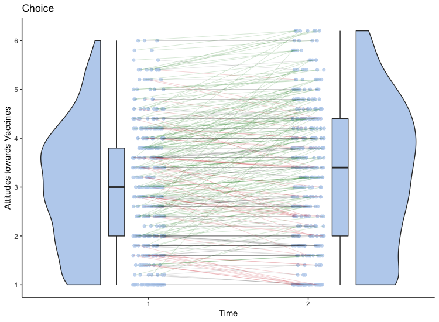

```{r setup,}
library(knitr)
knitr::opts_chunk$set(echo = FALSE, message=FALSE, warning=FALSE, fig.height=2, fig.width=4)
library(rethinking)
#library(here)
```

`r figsize<-'68%'`

# Introduction

You will find it useful to add 3 and 5 to make `r 3+5` compare the output PDF document with the .rmd document. This latter item is the thing you edit to produce the PDF. 

Communicating the effectiveness, necessity and safety of vaccination to the general public is arguably one of science communication’s most important and emblematic challenges. Appropriately, huge amounts of attention and research effort has been directed towards how to increase Covid-19 vaccination uptake. Due to the urgency and impact of the problem, a multi-pronged attack is warranted, and thus research rightly spans many different strategies, from pre-empting misinformation on social media (Vraga & Bode 2021), presenting information on the comparison of Covid-19 symptoms to vaccination side-effects (Thorpe et al. 2021), presenting information on the timeline of vaccine development (Thorpe et al. 2021), different styles of myth-busting (Challenger et al. 20201), the use of social norms (Moehring et al. 2021) and even chatbots (Altay et al. 2020), all with varying levels of success.  

Do I need a para here about chatbots in general? Usually used for tasks, only just starting to have real interest in their ability to have constructive dialogue etc? Check Altay’s GMO chatbot paper intro for inspo. 

Here we focus on the use of chatbots for attitude change. The use of chatbots to change attitudes is not restricted to vaccination hesitancy, and has previously been explored in the context of GMO attitudes (Altay et al. 2021). One such experiment that looked at the effect of a chatbot on GMO attitudes found that the chatbot had a positive effect on GMO attitudes compared to two comparisons; 1) a short description of GMOs 2) a description of the consensus scientific view, but it did not have a positive effect compared to a third condition that contained counterarguments. In this counterargument condition, participants were exposed to all GMO beliefs and counterarguments at once, rather than choosing which counterarguments to interact with. This suggested that choice of information, i.e. interactivity, was not the driving factor behind the success of the chatbot. Crucially, they did find that the positive attitudes were mediated by time spent in the conditions, and that people spent on average longer in the counterargument condition. They also found that in the chatbot condition, for three out of four arguments, the best predictor for selecting a given argument was how negative their initial view towards it was, so participants did seem to select arguments based on their concerns. 

This idea that choice of information is important chimes with research into people’s apparent preference for choosing their own actions, making their own decisions, and choosing what path to take, even if on average it leads to worse outcomes (Babadia-Suarez et al. 2017). More stuff here about choice? Or merge this with the previous para?

A recent study found that exposure to a chatbot increases positive attitudes towards Covid-19 vaccination compared to a control of 90 words (Altay et al. 2020). We would like to know what it is about chatbots that helps increase vaccination attitudes, as this experiment does not tell us whether it is the a) amount of information b) time spent with the information c) interactivity or choice of information or  d) trustworthiness of the information.  Role of trust “why should I trust you” section (Tom’s trust ref?)

To address this, we used the same information but created two conditions in which the only difference was the interactivity of the information, but the amount of information, time spent on the information and trustworthiness of the information was the same for both conditions.


## Example Subheading

Here are some example references in the following sentence. For reviews of this topic see @wickelgren1977speed; @heitz2014speed. Here is another example reference [e.g. @stafford2020] 


# Method


## Requirements

You should install R, RStudio and tex and papaja [@aust2020]. More details here https://crsh.github.io/papaja_man/introduction.html#getting-started


```{r}
#Once you've installed R/RStudio
#install.packages('tinytex')
#tinytex::install_tinytex()
#install.packages("devtools") 
#devtools::install_github("crsh/papaja")

#imo computational reproducibility / dependency management in R is a mess, but there we are
```

# Results

Now let's integrate some R code to generate/import some data, run and analyse and integrate it into the document:

Analysis done following @mcelreath2018statistical and his very nice book

```{r results='hide'}
#copying from https://bookdown.org/yihui/rmarkdown/r-code.html
#this is some R code which evaluates when you make the document
#

#----------------Code for generating some random data

#parameters of our variables
meanA <- 100
sdA <- 15
d <- .5
sdB <- sdA
pooledSD <- sdA
meanB <- meanA + (d * pooledSD)
n1 <- 300
n2 <- 300

#create random data, put into dataframe
groupA <- rnorm(n1, meanA, sdA)
groupB <- rnorm(n2, meanB, sdB)
sub <- 1:length(n1+n2)
group <- c(rep(0,n1) ,rep(1,n2))
values <- c(groupA, groupB)
df <- data.frame(sub, group, values)

#add some missing values
index <- sample(1:(n1+n2),5)
df[index, 3] <- NA

#export to a file
write.csv(df, file = "generateddata.csv")
```

Rmarkdown also lets us track figure labels, and updates them automatically. Look! Kittens! Illustrated in Figure \@ref(fig:examplefigurename).

```{r examplefigurename, fig.cap="Example figure caption", fig.align="center", out.width="75%"}

```

You can't see it, but in between this paragraph and the last we asked R to generate some random data and save it to a CSV file. Now we're going to import the data from the CSV file, as if it was independently created data - from an experiment or similar - and plot a graph.

```{r ourhistogram, fig.cap="Histogram of all data, grouped", fig.align="center", out.width="75%",fig.height=4}
#load data
df=read.csv("generateddata.csv")


#make histogram
#cribbing from https://www.statmethods.net/graphs/density.html
x <- df$values
x <- na.omit(x) #drop missing values
h<-hist(x, breaks=20, col="red", xlab="value")
xfit<-seq(min(x),max(x),length=40)
yfit<-dnorm(xfit,mean=mean(x),sd=sd(x))
yfit <- yfit*diff(h$mids[1:2])*length(x)
lines(xfit, yfit, col="blue", lwd=2) 
```

See Figure \@ref(fig:ourhistogram). Of course we could draw all sorts of things, but this is a proof-of-concept. Finally, let's run a t-test and integrate the results into the text.

```{r}
#note that seperate code chunks remember variables from previous chunks, so we don't need to reload the data
df$group <- as.factor(df$group)
model1<-t.test(df$values ~ df$group)

p<- model1$p.value
t<- model1$statistic
df<- model1$parameter
if(p<0.05){
  word<-"a"
} else {
  word<-"no"
}

model_1 <- readRDS("../model_objects/model1.rds")
```

mean = `r precis(model1)[2,1] ` and our credible intervals are from `r precis(model1)[2,3] ` to `r precis(model1)[2,4] `
    

We found there was `r word` statistically significant difference between the two groups (t=`r t` (`r df`), p = `r p`). Note how the exact values in the previous sentence change every time we re-make the document (because the document also re-generates the underlying data).

Unanswered questions: Is this the best way to integrate values into text? Why is the df not an integer? What is the best way to define figure sizes so you get nice and/or consistent sizing across document formats?

# Discussion

Make your document by opening .Rmd file in RStudio and clicking 'knit' 

Rmarkdown is good [@rmarkdowncite]. Need to change reference style? Change one line. Need to submit as PDF rather than .DOC? Just click 'Word' as output rather than 'PDF' (instructions here https://rmarkdown.rstudio.com/articles_docx.html). Need to change to two column style to make a nice pre-print? Again, simple - just change one line! In line 40 'class             : "man"' gives you manuscript style; "jou" gives you two column style.

To port to your own project just copy across these files:

* example_manuscript.rmd
* apa6.cls - style file which makes everything look APA format nice
* references.bib - information on references in bibtex format
* figs folder - where images integrated into the manuscript are kept

## Main conclusions

Of course, there's more effort in installing and learning and correctly marking up your document in the first place, but it is worth it


```{r results="hide"}
#how to get a citation for packages you use
citation('papaja')
```

# References
