```{r setup, include=FALSE}
knitr::opts_chunk$set(echo = FALSE)

# note to get figure referencing you need to change the output to bookdown::pdf_document2
# and use \ not /
# to have figure captions containing quotes you need to define them as variables (see below)
```

## Supplementary material 

# WAIC comparisons for hypothesis 2

```{r waics}

library(rethinking)
source("../results/loading_saved_models.R")
h2waics <-compare(h2_null, h2_full, h2_exp, h2_int)
waicTable <- subset(h2waics, select = c("WAIC","SE","weight")) 

kable(waicTable, caption = "Table showing the model comparison between our attitude models that address hypothesis 2. The table includes the Wanatabe-Akaike Information Criteria as well as their SEs and their akaike weights. The model holding the most weight is the model that contains the experiment effect only (h2exp), i.e. participants attitudes were most affected after taking part in the experiment, regardless of condition or interactions between time and condition  ")
```

# WAIC comparisons for exploratory time-spent analysis

```{r time_waics}
# need to load h2_int_time and h2_time from 15_exploratory_analysis.R
timewaics <- compare(h2_full_time,h2_int_time,h2_time)
waictable2 <- subset(timewaics, select = c("WAIC","SE","weight"))

kable(waicTable2, caption = "Table showing the model comparison between our exploratory models that look at the effect of spending more than the average amount of time reading the material. The table includes the Wanatabe-Akaike Information Criteria as well as their SEs and their akaike weights. The model holding the most weight is the full model, which contains both an interaction effect for post-treatment rating and spending above median time, as well as a main effect for post-treatment rating. This is good evidence that those who spend above the average amount of time in the study were more likely to show an increase in positive attitudes towards the Covid-19 vaccines")
```


# Vaccine attitudes by attitude type 

Plots showing the variation in vaccine attitudes in our population that reported being anti or neutral towards covid-19 vaccines. 

Safety: Figure \@ref(fig:figure1)


(ref:figcap1) Density plot of raw vaccination attitudes when asked 'how strongly do you agree with the following statement: I think Covid-19 vaccines are safe.'


```{r figure1, fig.cap='(ref:figcap1)', fig.align='center', out.width='100%'}
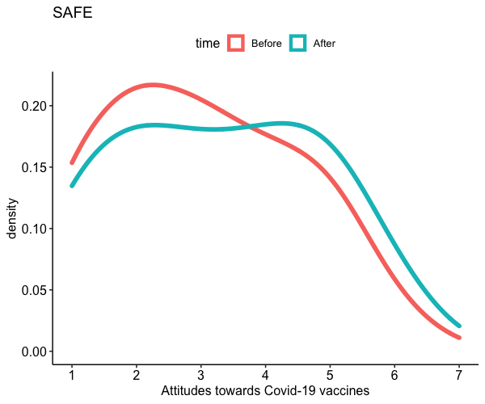
```


Effectiveness: \@ref(fig:figure2)

(ref:figcap2) Density plot of raw vaccination attitudes when asked 'how strongly do you agree with the following statement: I think Covid-19 vaccines are effective,'

```{r figure2, fig.cap="(ref:figcap2)", fig.align="center", out.width="100%"}
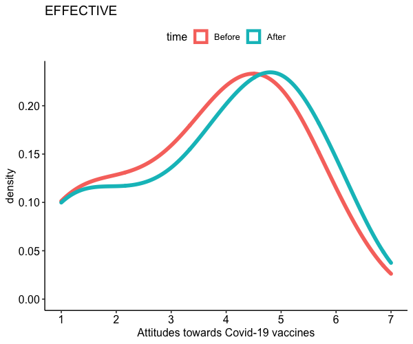
```

Enough time: \@ref(fig:figure3)

(ref:figcap3) Density plot of raw vaccination attitudes when asked 'how strongly do you agree with the following statement: I think we've had enough time to develop Covid-19 vaccines'

```{r figure3, fig.cap="(ref:figcap3)", fig.align="center", out.width="100%"}
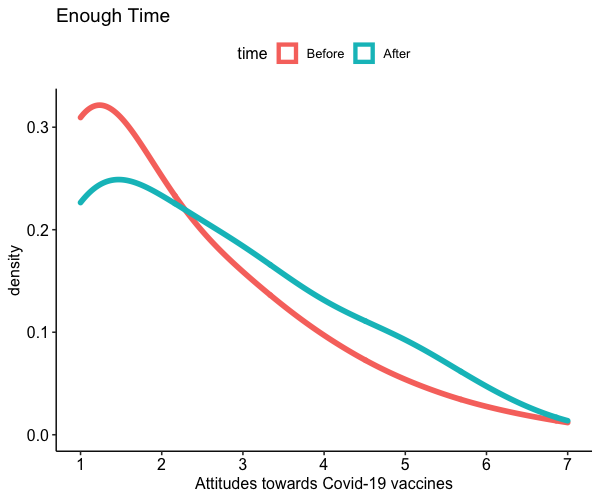
```

Trust: \@ref(fig:figure4)

(ref:figcap4) Density plot of raw vaccination attitudes when asked 'how strongly do you agree with the following statement: I think we can trust those who produce Covid-19 Vaccines'

```{r figure4, fig.cap="(ref:figcap4)", fig.align="center", out.width="100%"}
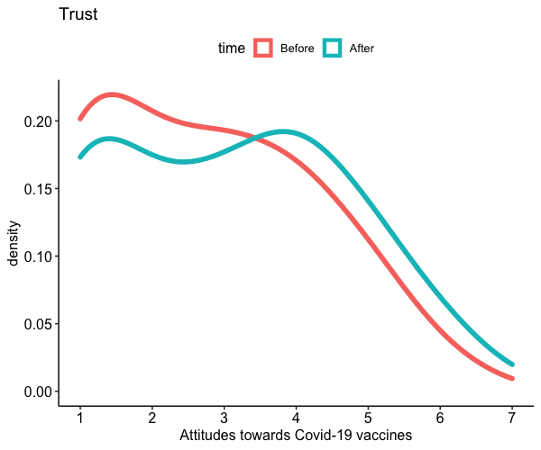
```

Important: \@ref(fig:figure5)

(ref:figcap5) Density plot of raw vaccination attitudes when asked 'how strongly do you agree with the following statement: I think it is important to be vaccinated against Covid-19'

```{r figure5, fig.cap="(ref:figcap5)", fig.align="center", out.width="100%"}
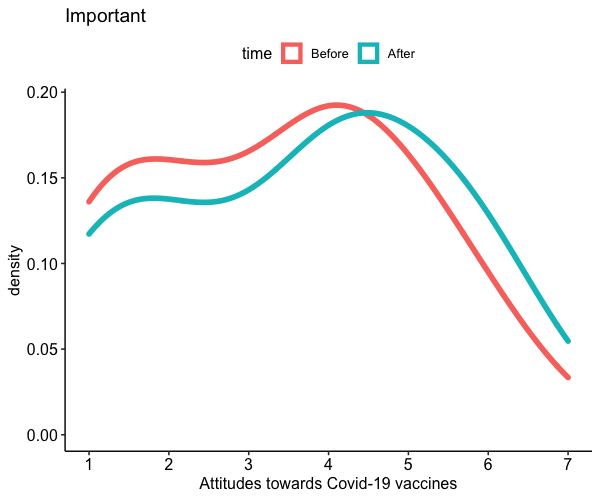
```


# Addressing regression to the mean

Plot suggesting that those who previously answered they were "against" Covid-19 vaccines were less likely to change their vaccination intentions and more likely to stay the same, compared to those who answered that they were "neutral" towards Covid-19 vaccines. This is the opposite of what we would expect if we were simply witnessing regression to the mean rather than an effect of the information. /@ref(fig:figure6)

```{r figure6, fig.cap="Plot showing the proportion of responses that either increased, decreased, or stayed the same when asked if they would take an approved Covid-19 vaccination in the future compared to when they were asked at the beginning of the experiment. The plot compares those who answered that they were Against Covid-19 vaccines or Neutral towards Covid-19 vaccines (as opposed to Positive towards Covid-19 vaccines in the Prolific Profiles used for Prescreening)", fig.align="center", out.width="100%"}
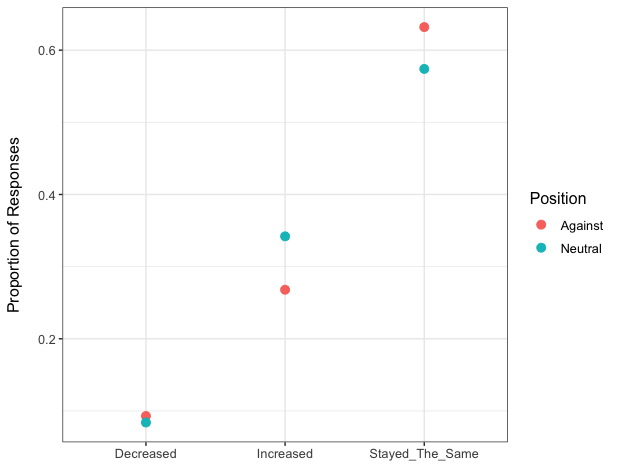
```

Note that the `echo = FALSE` parameter was added to the code chunk to prevent printing of the R code that generated the plot.

# Example images of what participants see

:
```{r figure7, fig.cap=" Example image of one of four choices in the choice condition", fig.align="center", out.width="100%"}
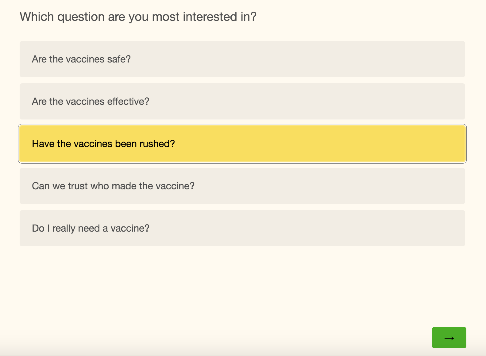
```

```{r figure8, fig.cap=" Example image of one of four choices in the choice condition", fig.align="center", out.width="100%"}
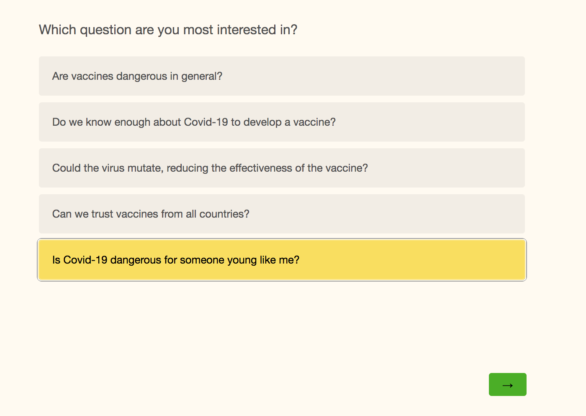
```

```{r figure9, fig.cap=" Example image of an information chunk that participants could see", fig.align="center", out.width="100%"}
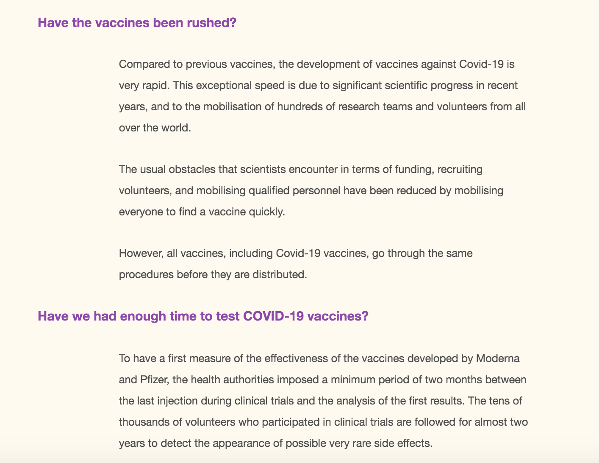
```

# Distribution of choices for each of the four choices

```{r figure10, fig.cap="Distribution of choices for the first choice in the choice condition", fig.align="center", out.width="100%"}
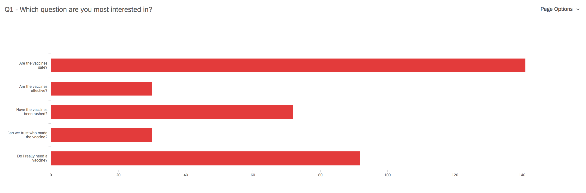
```

```{r figure11, fig.cap="Distribution of choices for the second choice in the choice condition", fig.align="center", out.width="100%"}
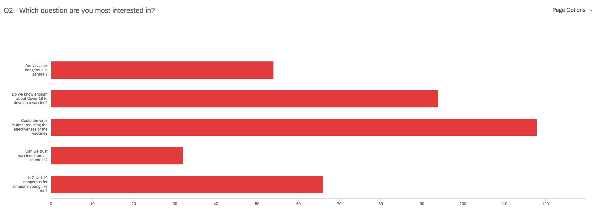
```

```{r figure12, fig.cap="Distribution of choices for the third choice in the choice condition", fig.align="center", out.width="100%"}
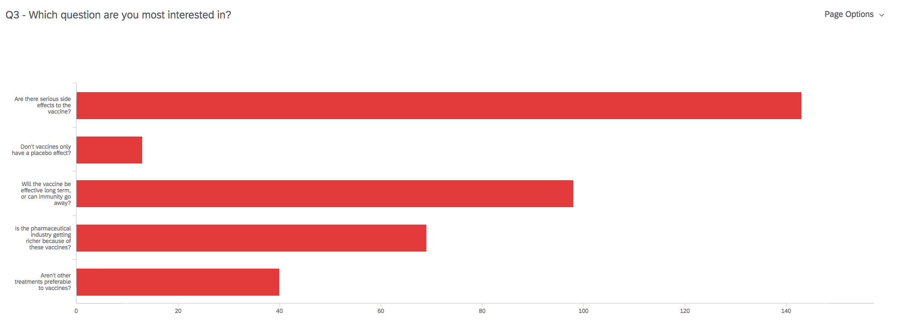
```

```{r figure13, fig.cap="Distribution of choices for the fourth choice in the choice condition", fig.align="center", out.width="100%"}
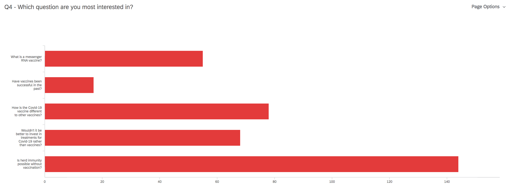
```